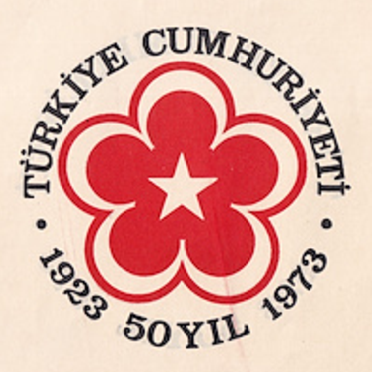

# 50. Yıl Amblemi
Cumhuriyetin 50. yılı ambleminin Javascript ve SVG kullanılarak çizimidir.

|   |   |
| --- | --- |
|  |  |

## Açıklama
Cumhuriyetimizin 50. yılı için hazırlanmış amblemin resmi bir tüzüğü bulunamamıştır.
Mevcut resim ve fotoğraflar incelenerek özgün bir spesifikasyon oluşturulmuştur.
Buna göre:
* Bir çember içine çepere teğet ve her biri Cumhuriyetin 10 yılını temsil eden
  birbirlerine teğet 5 adet ay, çember merkezine dönük olarak çizilmiştir.
* Çember dairesi bayrak kırmızısıdır.
* Ayların çember dışına dönük taraflarına kırmızı kontur çekilmiştir.
* Daire merkezinde bir adet 5 köşeli yıldız vardır.
* Çemberin kuzey yayı boyunca ve daire dışında olacak şekilde büyük harflerle `TÜRKİYE CUMHURİYETİ` yazılmıştır.
* Çemberin güney yayı boyunca ve daire dışında olacak şekilde büyük harflerle `1923  50 YIL  1973` yazılmıştır.
  Ayrıca başta ve sonda birer siyah nokta vardır.

## Yöntem
* Aylar bayrak tüzüğüne uygun olarak çizilir, bunun için [bayrak](https://github.com/alperali/bayrak)
  projesindeki bilgi ve birikimden faydalanılır:
  - ay iç çember yarıçapı = 48
  - ay dış çember yarıçapı = 60
  - ay dış çember merkezinin iç çember merkezine uzaklığı = 15
* Konturu çizmek için merkezi ay dış çemberi merkeziyle aynı, yarıçapı biraz daha fazla (+8 olarak tespit edilmiştir)
  kırmızı daire çizilir.
  - kontur çember yarıçapı = 68
* Bayrak yıldızının bayrak eksenini kestiği nokta, amblem üzerindeki yıldızın bir köşesi sayılır.
  5 ay için hesaplanan bu noktalar `<polygon>` ile birleştirilerek amblem yıldızı çizilir.
* Yukarıdaki ölçüye göre çizilen 5 ayın birbirine teğet olacak biçimde yerleşebileceği amblem çemberinin
  yarıçapı hesaplanmalıdır. Bunun için temel trigonometri kullanılır.

### Amblem çemberi yarıçapının hesaplanması


Yukarıdaki şekilde bir ay dış çemberinin amblem çemberi içindeki konumu gösterilmiştir.
**a** noktası ay dış çemberi merkezi, **c** noktası amblem çemberi merkezidir.
Ay dış çember yarıçapı *s* = 60 olduğunu biliyoruz. Amblem yapıçapı **h**+**s** olup **h**'yi bulmak istiyoruz.

Amblem çember merkezinden ay dış çemberinin her iki tarafına teğet doğrular çekersek, oluşan yayı gören açı `360/5 = 72` olur
(yeşil açı). **a** ve **c** noktalarından geçen doğru bu açıyı tam ikiye böler, `36` olur (mavi açı).
**c**'den ay çemberine teğet çekilen doğrunun teğet noktasına **a**'dan çekilen doğru dik açıyla iner, **abc** bir dik üçgendir.
`sin(36) = s/h` eşitliğinden `h = s/sin(36)` olur.

## Çözüm
➡️ [Tarayıcıda göster](https://alperali.github.io/50yil/50yil.html)

```html
<!doctype html>
<html>
<head>
  <meta charset="utf-8">
  <meta name="viewport" content="width=device-width, initial-scale=1">
  <title>50. Yıl Amblemi</title>
</head>
<body>
  <svg version="1.1" xmlns="http://www.w3.org/2000/svg">
    <defs>
      <style>
        @import url("https://fonts.googleapis.com/css2?family=Orelega+One&amp;display=swap");
      </style>
    </defs>
    <rect width="100%" height="100%" fill="white" />
  </svg>
  <script>
    const celm = (e) => document.createElementNS('http://www.w3.org/2000/svg', e);
    const s = document.querySelector('svg');
    const vb_en = 480, vb_boy = 480,   // viewBox en ve boyu
          kırmızı = "rgb(227,10,23)",  // (bayrak projesinden)
          ay_dış_yçap = 60,     // ay dış çember yarıçapı (bayrak projesinden)
          ay_iç_yçap = 48,      // ay iç çember yarıçapı (bayrak projesinden)
          ay_dış_iç_uzk = 15,   // ay iç çember merkezinin ay dış çember merkezine uzaklığı (bayrak projesinden)

          // ay dış çember merkezinin amblem çember merkezine uzaklığı
          ay_dış_amblem_uzk =  ay_dış_yçap / Math.sin(Math.PI/5),  // 36 deg == Math.PI/5 rad

          // iç çemberin uçkur yönünde ekseni kesen noktasından bayrak eninin üçte biri uzaklıktadır (bayrak projesinden)
          yıldız_köşesi_y = vb_boy/2 - ay_dış_amblem_uzk + ay_dış_iç_uzk - ay_iç_yçap + 80 + 4,
          
          yıldız_yçap = vb_boy/2 - yıldız_köşesi_y,       // yıldız çemberinin yarıçapı
          amblem_yçap = ay_dış_amblem_uzk + ay_dış_yçap,  // amblem çemberinin yarıçapı
          kontur_yçap = ay_dış_yçap + 8,                  // kontur çemberinin yarıçapı

          // yıldızın köşe koordinatları, saat yönünde
          köşeler = [
            {x: vb_en/2, y: yıldız_köşesi_y},
            {x: vb_en/2 + Math.sin(2*Math.PI/5)*yıldız_yçap, y: vb_boy/2 - Math.cos(2*Math.PI/5)*yıldız_yçap},
            {x: vb_en/2 + Math.sin(Math.PI/5)*yıldız_yçap,   y: vb_boy/2 + Math.cos(Math.PI/5)*yıldız_yçap},
            {x: vb_en/2 - Math.sin(Math.PI/5)*yıldız_yçap,   y: vb_boy/2 + Math.cos(Math.PI/5)*yıldız_yçap},
            {x: vb_en/2 - Math.sin(2*Math.PI/5)*yıldız_yçap, y: vb_boy/2 - Math.cos(2*Math.PI/5)*yıldız_yçap}
          ];

    s.setAttribute("viewBox", `0 0 ${vb_en} ${vb_boy}`);

    // kontur çemberlerinin çizimi
    for (let i=0; i<5; ++i) {
      const tt = celm('circle');
      tt.setAttribute('cx', '50%');
      tt.setAttribute('cy', `${vb_boy/2 - ay_dış_amblem_uzk}`);
      tt.setAttribute('r', `${kontur_yçap}`);
      tt.setAttribute('fill', `${kırmızı}`);
      i && tt.setAttribute('transform', `rotate(${72*i},${vb_en/2},${vb_boy/2})`);
      s.appendChild(tt);
    }

    // ayların çizimi
    for (let i=0; i<5; ++i) {
      const dış = celm('circle');
      dış.setAttribute('cx', '50%');
      dış.setAttribute('cy', `${vb_boy/2 - ay_dış_amblem_uzk}`);
      dış.setAttribute('r', `${ay_dış_yçap}`);
      dış.setAttribute('fill', 'white');
      i && dış.setAttribute('transform', `rotate(${72*i},${vb_en/2},${vb_boy/2})`);
      s.appendChild(dış);

      const iç = celm('circle');
      iç.setAttribute('cx', '50%');
      iç.setAttribute('cy', `${vb_boy/2 - ay_dış_amblem_uzk + ay_dış_iç_uzk}`);
      iç.setAttribute('r', `${ay_iç_yçap}`);
      iç.setAttribute('fill', `${kırmızı}`);
      i && iç.setAttribute('transform', `rotate(${72*i},${vb_en/2},${vb_boy/2})`);
      s.appendChild(iç);
    }

    // ortadaki boşluğu dolduran kırmızı daire
    const tt = celm('circle');
    tt.setAttribute('cx', '50%');
    tt.setAttribute('cy', '50%');
    tt.setAttribute('r', `${yıldız_yçap}`);
    tt.setAttribute('fill', `${kırmızı}`);
    s.appendChild(tt);

    // yıldızın çizimi
    const po = celm('polygon');
    po.setAttribute('points',
      `${köşeler[0].x},${köşeler[0].y}`.concat(
      ` ${köşeler[2].x},${köşeler[2].y}`,
      ` ${köşeler[4].x},${köşeler[4].y}`,
      ` ${köşeler[1].x},${köşeler[1].y}`,
      ` ${köşeler[3].x},${köşeler[3].y}`)
    );
    po.setAttribute('fill', 'white');
    s.appendChild(po);

    // yazılar
    const df = celm('defs');
    s.appendChild(df);

    const yz_offset = 16;
    let pa = celm('path');
    pa.setAttribute('id', 'üstyazı');
    pa.setAttribute('d', `M${vb_en/2 - amblem_yçap - yz_offset},${vb_boy/2} a1,1 0 0 1 ${2*amblem_yçap + 2*yz_offset},0`);
    df.appendChild(pa);
    
    pa = celm('path');
    pa.setAttribute('id', 'altyazı');
    pa.setAttribute('d', `M${vb_en/2 - amblem_yçap - 3*yz_offset},${vb_boy/2} a1,1 0 0 0 ${2*amblem_yçap + 6*yz_offset},0`);
    df.appendChild(pa);

    let tp = celm('textPath');
    tp.setAttribute('href', `#üstyazı`);
    tp.textContent = 'TÜRKİYE  CUMHURİYETİ';
    let tx = celm('text');
    // tx.setAttribute('style', 'font-family: serif; font-weight: bold; font-size: 6.2ex; white-space: pre;');
    tx.setAttribute('style', 'font-family: "Orelega One", serif; font-size: 49px; word-spacing: 10px; letter-spacing: -0.75px;');
    s.appendChild(tx).appendChild(tp);

    tp = celm('textPath');
    tp.setAttribute('href', '#altyazı');
    tp.innerHTML = '  \u2981  1923  <tspan style="word-spacing: normal;">50 YIL</tspan>  1973  \u2981  ';   // \u25CF
    tp.setAttribute('startOffset', '32px');
    tx = celm('text');
    // tx.setAttribute('style', 'font-family: serif; font-weight: bold; font-size: 6.6ex; white-space: pre; letter-spacing: 0.15ex;');
    tx.setAttribute('style', 'font-family: "Orelega One", serif; font-size: 52px; word-spacing: 20px; letter-spacing: 1.8px;');
    s.appendChild(tx).appendChild(tp);
  </script>
</body>
</html>
```

## Sonuç
➡️ [Tarayıcıda göster](https://alperali.github.io/50yil/50yil.svg)

```svg
<svg version="1.1" xmlns="http://www.w3.org/2000/svg" viewBox="0 0 480 480">
  <defs>
    <style>
      @import url("https://fonts.googleapis.com/css2?family=Orelega+One&amp;display=swap");
    </style>
  </defs>
  <rect width="100%" height="100%" fill="white"></rect>
  <circle cx="50%" cy="137.9219029977552" r="68" fill="rgb(227,10,23)"></circle>
  <circle cx="50%" cy="137.9219029977552" r="68" fill="rgb(227,10,23)" transform="rotate(72,240,240)"></circle>
  <circle cx="50%" cy="137.9219029977552" r="68" fill="rgb(227,10,23)" transform="rotate(144,240,240)"></circle>
  <circle cx="50%" cy="137.9219029977552" r="68" fill="rgb(227,10,23)" transform="rotate(216,240,240)"></circle>
  <circle cx="50%" cy="137.9219029977552" r="68" fill="rgb(227,10,23)" transform="rotate(288,240,240)"></circle>
  <circle cx="50%" cy="137.9219029977552" r="60" fill="white"></circle>
  <circle cx="50%" cy="152.9219029977552" r="48" fill="rgb(227,10,23)"></circle>
  <circle cx="50%" cy="137.9219029977552" r="60" fill="white" transform="rotate(72,240,240)"></circle>
  <circle cx="50%" cy="152.9219029977552" r="48" fill="rgb(227,10,23)" transform="rotate(72,240,240)"></circle>
  <circle cx="50%" cy="137.9219029977552" r="60" fill="white" transform="rotate(144,240,240)"></circle>
  <circle cx="50%" cy="152.9219029977552" r="48" fill="rgb(227,10,23)" transform="rotate(144,240,240)"></circle>
  <circle cx="50%" cy="137.9219029977552" r="60" fill="white" transform="rotate(216,240,240)"></circle>
  <circle cx="50%" cy="152.9219029977552" r="48" fill="rgb(227,10,23)" transform="rotate(216,240,240)"></circle>
  <circle cx="50%" cy="137.9219029977552" r="60" fill="white" transform="rotate(288,240,240)"></circle>
  <circle cx="50%" cy="152.9219029977552" r="48" fill="rgb(227,10,23)" transform="rotate(288,240,240)"></circle>
  <circle cx="50%" cy="50%" r="51.07809700224479" fill="rgb(227,10,23)"></circle>
  <polygon
    points="240,188.9219029977552 270.0229521330839,281.3230485151481 191.42184300605913,224.2159999859743 288.57815699394087,224.2159999859743 209.97704786691614,281.3230485151481"
    fill="white">
  </polygon>
  <defs>
    <path id="üstyazı" d="M61.92190299775521,240 a1,1 0 0 1 356.1561940044896,0"></path>
    <path id="altyazı" d="M29.92190299775521,240 a1,1 0 0 0 420.1561940044896,0"></path>
  </defs>
  <text style="font-family: 'Orelega One', serif; font-size: 49px; word-spacing: 10px; letter-spacing: -0.75px;">
    <textPath href="#üstyazı">TÜRKİYE CUMHURİYETİ</textPath>
  </text>
  <text style="font-family: 'Orelega One', serif; font-size: 52px; word-spacing: 20px; letter-spacing: 1.8px;">
    <textPath href="#altyazı" startOffset="32px"> ⦁ 1923 <tspan style="word-spacing: normal;">50 YIL</tspan> 1973 ⦁ </textPath>
  </text>
</svg>
```

